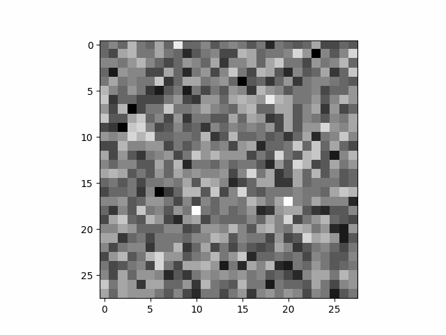
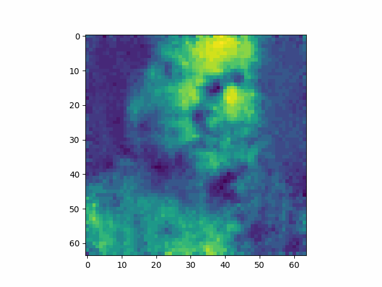
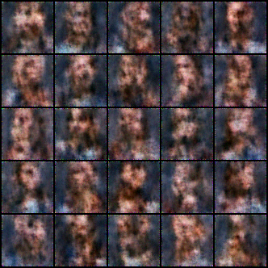

# Diffusion-Model-Learning
This repo is mainly for learning diffusion models and application. 

The progression of the de-noising process can be viewed here:

Run diffusion model on a set of face dataset and train for only 1000 training step. Plausible results will be obtained if num_training_step is set to 700000.

Sample some images from the model - note that the model has not yet converged/optimised.

